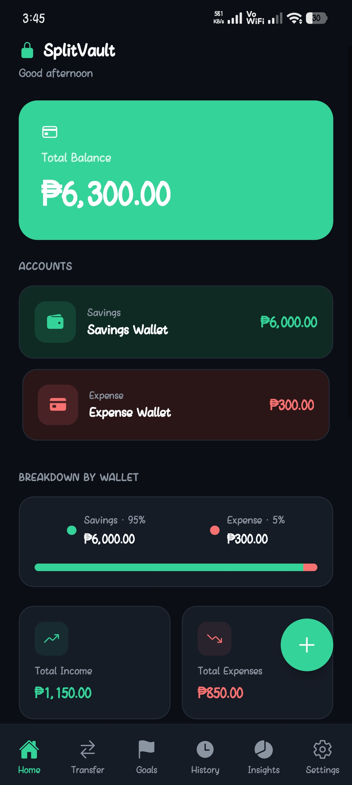
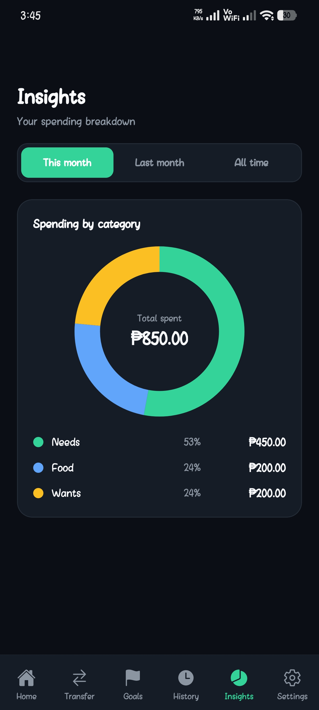
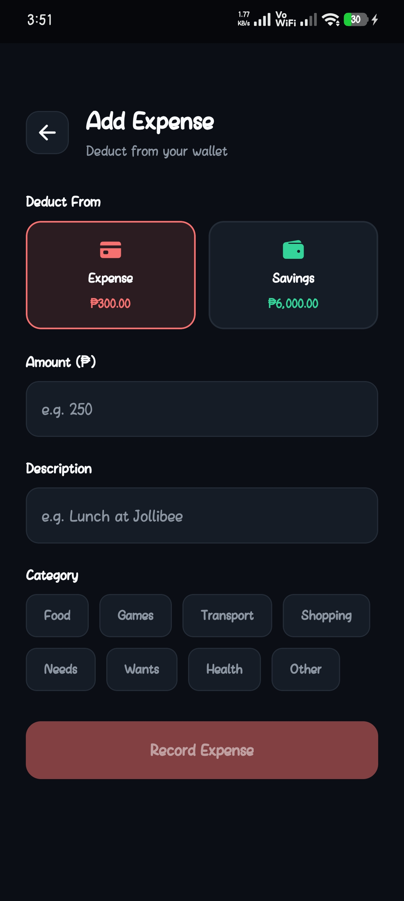
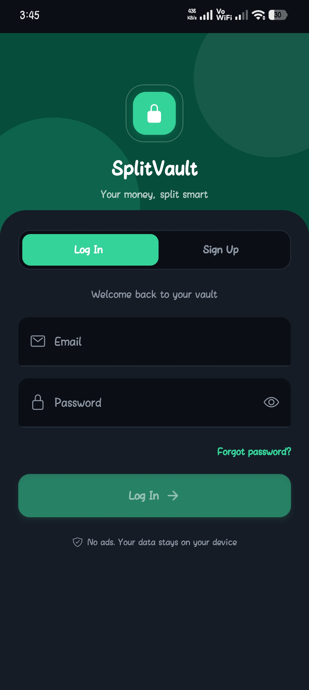
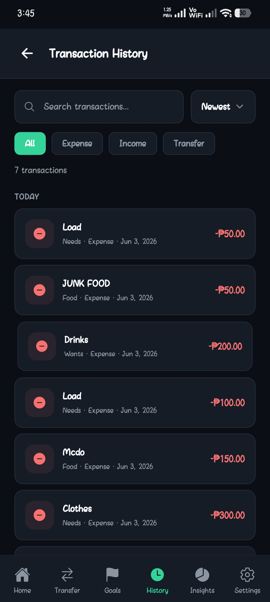
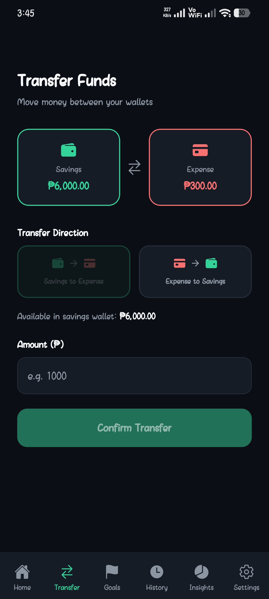

# SplitVault

**Split your money smart.** SplitVault is a personal finance app for Android that helps you separate your money into two purposeful wallets — **Savings** and **Expense** — so you always know what's safe to spend and what's set aside. Built with React Native and a local-first architecture backed by cloud sync.

> Currency: Philippine Peso (₱) · Platform: Android (React Native + Expo)

---

## Screenshots

| Home | Insights | Add Expense |
|------|----------|-------------|
|  |  |  |

| Sign In | History | Transfer |
|---------|---------|----------|
|  |  |  |


---

## Features

- **Two-wallet system** — keep Savings and Expense balances separate, and transfer between them with a clear, directional flow.
- **Income, expenses, and transfers** — add income to either wallet, record expenses by category, and move money between wallets.
- **Savings goals** — set targets, add funds, and track progress visually.
- **Transaction history** — search, filter by type, sort, and edit or delete entries, with balances that always recalculate correctly.
- **Spending insights** — a category breakdown donut chart with This Month / Last Month / All Time ranges.
- **App lock** — optional PIN with biometric (fingerprint/face) unlock, powered by the device's secure store.
- **Light and dark themes** — a fully theme-aware interface.
- **Data export** — download a JSON backup of all your data at any time.
- **Accounts** — email and password authentication, with sessions that persist across restarts.

---

## Architecture Highlights

**Local-first with cloud sync.** The app treats the device's local storage as the source of truth, so reads are instant and the app remains fully usable **offline**. Every change is saved locally first, then backed up to the cloud in the background. When a user signs in on a new device, their data is restored from the cloud.

- **Offline-first reads/writes** — backed by on-device storage (`AsyncStorage`), so the app works with no internet connection.
- **Cloud backup & restore** — data syncs to Cloud Firestore, scoped per user, enabling cross-device restore.
- **Per-user data isolation** — Firestore security rules ensure each account can only ever read or write its own data.
- **Persisted authentication** — Firebase Auth keeps users signed in between sessions.

---

## Tech Stack

- **Framework:** React Native (Expo)
- **Navigation:** React Navigation (bottom tabs)
- **Backend:** Firebase — Authentication (email/password) + Cloud Firestore
- **Local storage:** `@react-native-async-storage/async-storage`
- **Secure storage:** `expo-secure-store` (PIN) + `expo-local-authentication` (biometrics)
- **Charts:** `react-native-svg`
- **UX:** `react-native-keyboard-aware-scroll-view`, custom themed toasts and dialogs

---

## Getting Started

### Prerequisites

- [Node.js](https://nodejs.org/) (LTS)
- The [Expo Go](https://expo.dev/go) app on an Android device, or an Android emulator
- A free [Firebase](https://firebase.google.com/) project

### Installation

```bash
# 1. Clone the repository
git clone https://github.com/Icession/SplitVault.git
cd SplitVault

# 2. Install dependencies
npm install

# 3. Set up your Firebase config (see below)

# 4. Start the development server
npx expo start
```

Then scan the QR code with Expo Go (Android) to run the app.

### Firebase Setup

This project uses Firebase for authentication and cloud sync. The real config file is kept out of version control, so you'll provide your own:

1. Create a project in the [Firebase Console](https://console.firebase.google.com/).
2. **Authentication** → enable the **Email/Password** sign-in method.
3. **Firestore Database** → create a database.
4. **Firestore → Rules** → publish these per-user rules:

   ```
   rules_version = '2';
   service cloud.firestore {
     match /databases/{database}/documents {
       match /users/{userId}/{document=**} {
         allow read, write: if request.auth != null && request.auth.uid == userId;
       }
     }
   }
   ```

5. Copy the example config and fill in your project's values:

   ```bash
   cp src/firebase/firebaseConfig.example.js src/firebase/firebaseConfig.js
   ```

   Then edit `src/firebase/firebaseConfig.js` with the values from
   **Firebase Console → Project settings → Your apps → SDK setup and configuration**.

> **Note on config keys:** Firebase web/client config values are not secrets — they ship inside every client app. User data is protected by Firestore **security rules** and authentication, not by hiding these values. The config file is kept out of the repo as good practice, not as a security control.

---

## Project Structure

```
SplitVault/
├── App.js                  # Root: auth gate, app-lock gate, navigation
├── src/
│   ├── components/         # Reusable UI (dialogs, toasts, fields, charts helpers)
│   ├── constants/          # Categories, currency formatting, shared helpers
│   ├── firebase/           # Firebase init + auth helpers
│   ├── navigation/         # Tab navigator + auth flow
│   ├── screens/            # Home, Transfer, Goals, History, Insights, Settings, etc.
│   ├── storage/            # Local-first data layer + cloud sync, app-lock storage
│   └── theme/              # Theme context + light/dark palettes
└── assets/                 # App icon, splash, adaptive icon
```

---

## Roadmap

- Google sign-in
- Recurring transactions and budgets
- Monthly income vs. expense trends
- Google Play Store release

---

## License

See [LICENSE](LICENSE) for details.